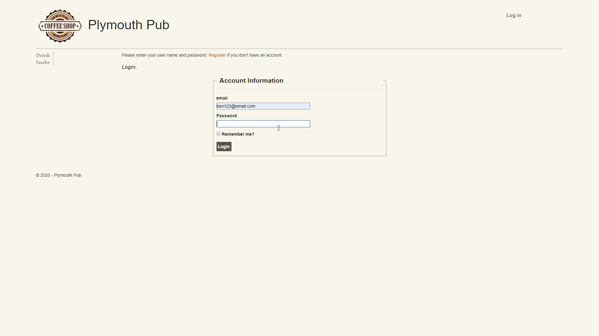
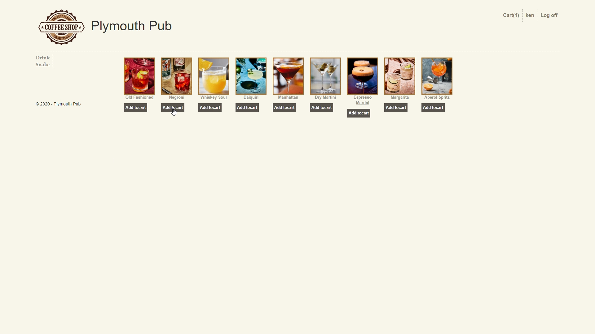
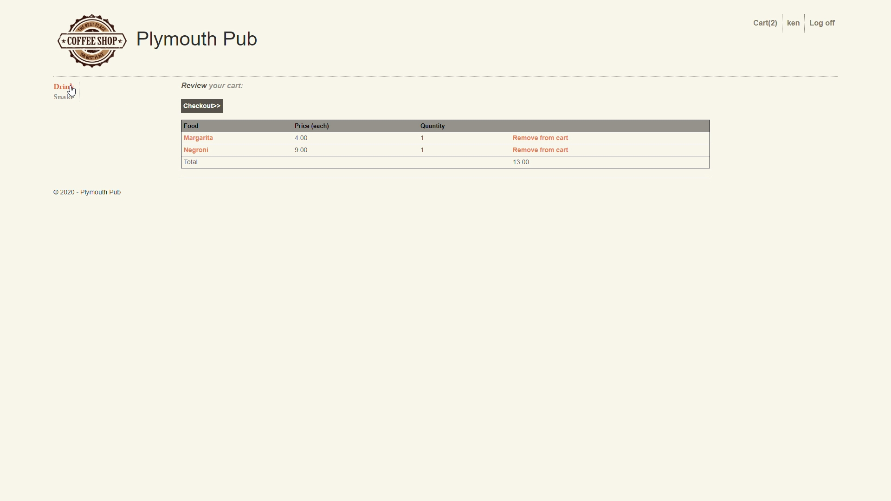
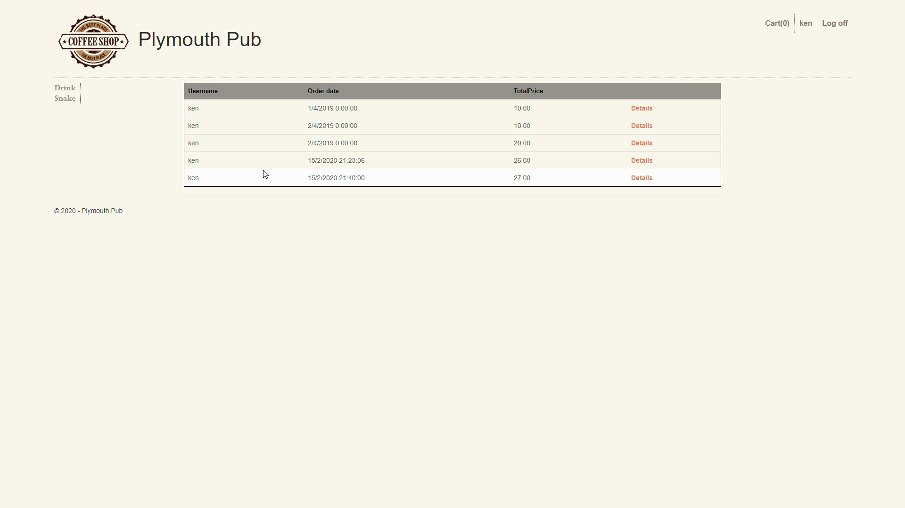
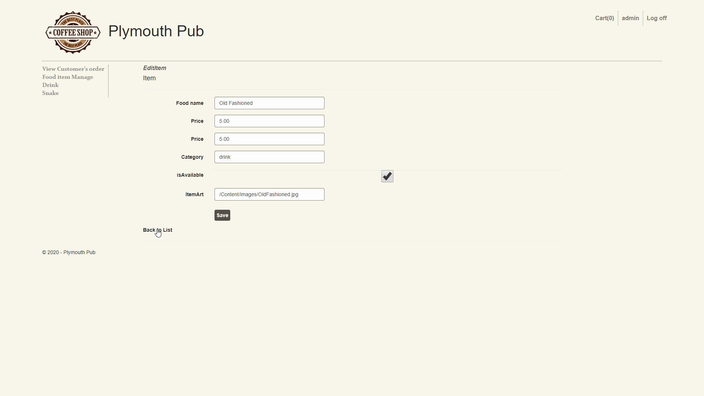
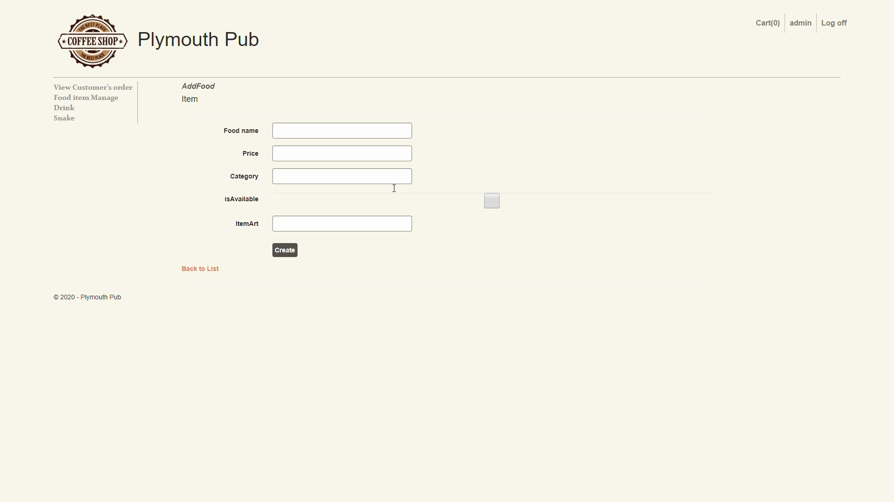

# ISAD251HK_Plymouthpub

Youtube video
---------------------------------
https://youtu.be/GlPmezEg-Ek

Screenshots
--------------------------------

Login page
----

Menu 
----

Shopping cart
---

Order History
----

Edit drink/snack
----

add a drink/snack
-----

### Application fact sheet

The Application Called "Pub", is an application that allows a user to order food/drinks from a menu and be able to view what they ordered, and if they want to cancel the order, he 
The admin using this application can look at the orders and items and be able to edit/add or delete these items. This application has 9 features:

Order a drink/food
A customer can view their order
Add to an order
Cancel an order
Add an Item
Edit an Item
Admin can view Orders
Admin and user can view items
withdraw a drink/snack from sale
